| Robot Image | Company Name | Robot Model | Official Website | City | Notes |
| :---: | :---: | :---: | :---: | :---: | :---: |
| 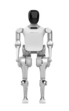 | Noetix Robotics | N2 | https://en.noetixrobotics.com/ | Beijing | N/A |
|  | Booster Robotics | T1 | https://www.booster.tech/ | Beijing | N/A |
| 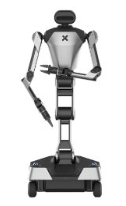 | Galaxea AI | R1 Pro | https://galaxea-ai.com/ | Beijing | N/A |
| 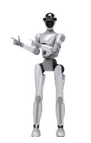 | CASBOT | 01 | https://casbot.tech/ | Beijing | N/A |
| 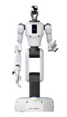 | General | G1 | https://www.galbot.com/ | Beijing | N/A |
| 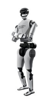 | RobotEra | L7 | https://www.robotera.com/ | Beijing | N/A|
|  | Corenetic | Monte 02 | https://www.corenetic.ai/ | Beijing | N/A |
| 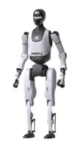 | Beijing Humanoid Robot Innovation Center | TienKung 2.0 | https://www.x-humanoid.com/ | Beijing | N/A |
| 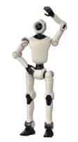 | Phybot | C1 | https://www.phybot.tech/en/home | Beijing | N/A |
| 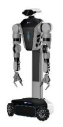 | Dexteleop Intelligence | TA-Lite | https://www.dexteleop.com/ | Beijing | N/A |
| 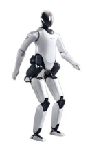 | Xiaomi | CyberOne | https://www.mi.com/cyberone | Beijing | N/A |
| 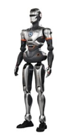 | EngineAI | PM01 | https://www.engineai.com.cn/ | Shenzhen | N/A |
| 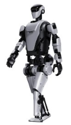 | Leju Robotics | KUAVO-MY | https://www.lejurobot.com/ | Shenzhen | N/A |
| 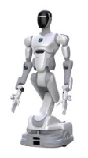 | AI2Robotics | AlphaBot | https://ai2robotics.com/ | Shenzhen | N/A |
| 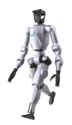 | DOBOT | Atom-Max | https://www.dobot-robots.com/ | Shenzhen | N/A |
| 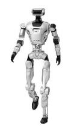 | LimxDynamics | Limx Oli | https://www.limxdynamics.com/ | Shenzhen | N/A |
| 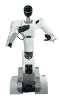 | Astribot | S1 | https://www.astribot.com/ | Shenzhen | N/A |
| 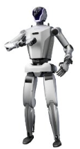 | Cyborg | Cyborg | https://www.cyb-org.cn/ | Shenzhen | N/A |
| 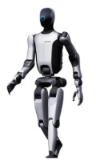 | UBTech Robotics | Walker S2 | https://www.ubtrobot.com/ | Shenzhen | N/A |
| 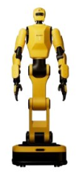 | DexForce | W1 Pro | https://www.dexforce.com/ | Shenzhen | N/A |
| 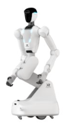 | XSquare Robot | Quanta-X2 | https://www.x2robot.com/ | Shenzhen | N/A |
| 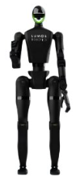 | Lumos Robotics | LUS2 | https://www.lumosbot.tech/ | Shenzhen | N/A |
